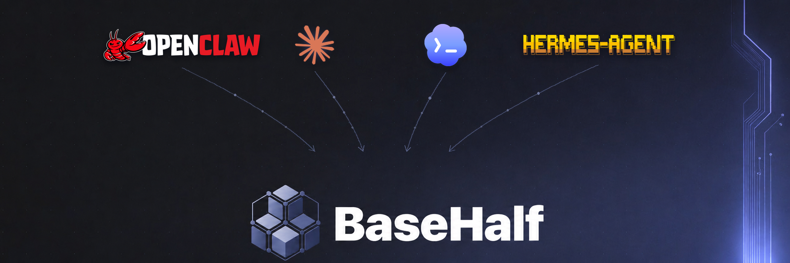
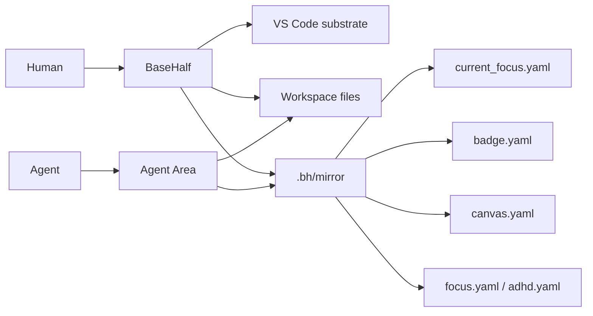

<p align="center">
  
</p>

> **Half AI. Half human. Half machine. Half flesh.**<br>
> **A canvas-first desktop workspace for thinking with files and agents.**

BaseHalf is an open-source, local-first desktop workspace built on a real VS
Code substrate. It keeps your files in a normal folder, gives humans a
canvas/card-detail way to navigate that folder, and builds a `.bh/` protocol
layer so agents can stay oriented in the same materials.

<div align="center">

[![Download][badge-download]][latest-release]
[![Discussions][badge-discussions]][discussions]
[![Twitter / X][badge-twitter]][twitter]
[![Discord][badge-discord]][discord]
[![QQ Groups][badge-qq-groups]][community]

[![Web Version][badge-website]][website]
[![GitCGR][badge-gitcgr]][gitcgr]
[![Apache-2.0][badge-license]][license]

</div>

**Status:** BaseHalf 0.4.1 is the current public macOS Apple Silicon release.
It is usable, early, and changing quickly. The product has moved from the old
hand-rolled Electron/core shell onto `vscode-base/`, where VS Code provides the
application substrate and BaseHalf owns the canvas-first product layer.

Download the latest build from [GitHub Releases][latest-release]. The current
macOS build is unsigned and unnotarized, so Gatekeeper may block the first
launch. After dragging the app to Applications, run:

```bash
xattr -dr com.apple.quarantine /Applications/BaseHalf.app
```

## Why BaseHalf

AI agents are good at reading and editing files, but people think through
spatial context, references, partial attention, and "where was I?" signals.
BaseHalf is the meeting place: a real folder remains the source of truth, while
the app adds a visual canvas, file cards, Markdown projections, Git/Search/File
surfaces, and an agent-readable local mirror beside the work.

BaseHalf is not trying to become the agent. It is a substrate for compound work:
humans keep the map, agents use their own tools, and both sides can inspect the
same local project without a cloud account or hidden database.

The `.bh/` layer is a core part of that product direction, not a legacy detail.
It is where BaseHalf will publish the workspace map, current focus, references,
canvas layout, reading state, and agent-facing context. The current release has
the first mirror primitives in place; the broader `.bh` protocol is one of the
main areas still being built out.

## Product Shape

- **Canvas first.** Folders open as canvases. Files open as full-screen card
  detail inside the BaseHalf flow. VS Code editor tabs remain fallback plumbing,
  not the default product model.
- **Real files stay real.** Markdown, code, media, and project files remain in
  the workspace folder. Git, external editors, and agents see ordinary files.
- **`.bh/` is the agent context layer.** BaseHalf keeps user content in real
  files and uses `.bh/` for local derived context: mirrors, focus, canvas state,
  references, and reading aids. This is a first-class product workstream, even
  though the VS Code-base migration has recently been the active focus.
- **VS Code is the lower layer.** BaseHalf reuses VS Code's Explorer, Search,
  SCM/Git, quick input, working-copy/file services, menus, settings, extension
  host, and terminal process APIs.
- **The left sidebar is small.** The visible sidebar product surface is Files,
  Git, and Search. Open Editors, generic Extensions, Debug, Testing, Problems,
  Remote Explorer, stock Chat/Copilot/Sessions, and the stock terminal panel
  are hidden or remapped while BaseHalf keeps its own product shape.
- **The right side is Agent Area.** Agent Area hosts TUI agents, curated
  extension agents, and plain shell sessions with tabs, panes, splits, restart,
  kill, resize, and zoom controls.
- **Markdown has projections.** A Markdown file is one working copy with three
  card-detail projections: `rich` by default, `source` for raw Markdown, and
  `preview` for read-only rendered Markdown.

## Agent Area

BaseHalf's first-class session choices are intentionally narrow:

- **Codex** - runs the `codex` CLI as a TUI session.
- **Claude Code** - runs the `claude` CLI as a TUI session.
- **Codex Extension** - hosts the curated VS Code Codex extension experience.
- **Claude Code Extension** - hosts the curated VS Code Claude Code extension
  experience.
- **Terminal** - opens a shell for OpenCode, Gemini CLI, or another terminal
  based agent.

Extension support starts curated, not marketplace-open. BaseHalf currently
allows only the extension families needed for Git/GitHub auth and the Codex /
Claude agent surfaces.

## `.bh` Local Protocol

BaseHalf publishes context instead of injecting prompts. Agents can read the
workspace files directly and, when useful, inspect `.bh/`. This protocol is the
planned shared language between the app, the human's visual workspace, and
file-based agents:



The mirror is deliberately plain. The current implementation already uses these
shapes as the foundation, and future `.bh` work will make this layer more
complete and more useful to agents:

- `.bh/current_focus.yaml` points to the active node's `focus.yaml`.
- `.bh/mirror/<path>/badge.yaml` stores a file or folder description plus
  `references` and `referenced_by`.
- `.bh/mirror/<folder>/canvas.yaml` stores card geometry plus reference-edge
  endpoints and anchors for that folder canvas.
- `.bh/mirror/<path>/focus.yaml` mirrors the current file projection, cursor or
  visible lines, or a folder canvas viewport.
- `.bh/mirror/<file>/adhd.yaml` stores per-file reading aids such as highlights
  and read ranges.

References are an explicit directed context-flow graph: `A → B` means A's
context flows into B. The graph is not a tree; many-to-many relationships and
cycles are valid, while self-references are not. Users and Agents create cards
and references explicitly. Markdown links remain ordinary document navigation
and never create a BaseHalf reference automatically. Canvas edges visualize the
same graph with endpoints and anchors only, without relationship labels or
notes.

User files remain content truth. `.bh/` is a local derived mirror, and automated
BaseHalf services observe/reconcile unless the user triggers a concrete write.
Agents edit files with their own tools.

## What Works Today

- Open a real local folder and land in the BaseHalf canvas workbench.
- Browse Files, Git, and Search using VS Code-backed side views.
- Open folders as canvases and files as BaseHalf card detail instead of editor
  tabs.
- Drag cards, persist positions, explicitly connect directed context-flow
  references with anchored edges, use snap guides, and explicitly repair or
  discard incomplete Agent-written reference pairs from the Badge surface.
- Use Quick Open and Quick Text Search while result activation still routes
  back into BaseHalf card detail.
- Edit Markdown in rich mode, switch to source or preview, and keep Markdown as
  the single file truth.
- Open code and non-Markdown text through the source card detail.
- Use VS Code's native Git provider, repository state, branch quick pick, SCM
  refresh, and publish-branch flow.
- Run Codex, Claude Code, curated extension agents, and shell agents inside the
  Agent Area.
- Read BaseHalf settings in VS Code's Settings UI under the BaseHalf category.
- See release notes as a system page without creating workspace files.

The smoke suite guards this shape: hidden competing workbench surfaces, Files /
Git / Search sidebar state, Agent Area sessions, canvas routing, Quick Open /
Search routing, Markdown rich/source behavior, Git provider integration, and
release notes.

## Install

1. Download `BaseHalf-0.4.1-darwin-arm64.dmg` from
   [the latest release][latest-release].
2. Open the DMG and drag `BaseHalf.app` into Applications.
3. If macOS blocks first launch, remove the quarantine attribute:

```bash
xattr -dr com.apple.quarantine /Applications/BaseHalf.app
```

The app's update feed is served from GitHub Releases through the signed
BaseHalf update manifest.

## Develop From Source

Current desktop development happens in `vscode-base/`. The older `packages/`
tree is useful for migration history and tests, but new desktop-facing product
work should be VS Code-aligned workbench/platform code.

Requirements:

- macOS for the current desktop packaging path.
- Node `24.17.0` from `vscode-base/.nvmrc`.
- npm.

```bash
cd vscode-base
nvm use
npm install
npm run compile
./scripts/code.sh
```

Useful checks:

```bash
cd vscode-base
npm run typecheck-client
./scripts/test.sh
npm run basehalf:smoke
```

For BaseHalf UI/routing changes, `npm run basehalf:smoke` is the important
product smoke. If `out/` is already current, `npm run basehalf:smoke-no-compile`
skips the compile step.

Package a macOS release build:

```bash
cd vscode-base
build/basehalf/package-darwin.sh arm64
```

## Repo Layout

```text
vscode-base/                         current desktop product source
  src/vs/workbench/basehalf/         BaseHalf canvas, card detail, Agent Area,
                                     profile, routing, mirrors, tests
  src/vs/platform/basehalf/          BaseHalf platform services such as update
                                     protocol and mirror-link helpers
  extensions/basehalf/               rich Markdown webview/editor assets
  build/basehalf/                    macOS package, DMG, and update scripts
  BASEHALF_UPSTREAM.md               VS Code import baseline

docs/                                public specs, decisions, and policies
  harness/                           BaseHalf's progressive development harness
private-docs/                        private product/architecture decision corpus
packages/                            historical BaseHalf core/desktop material
```

## Architecture Principles

1. **VS Code substrate, BaseHalf product.** Prefer VS Code services and
   workbench patterns for infrastructure; keep BaseHalf's product layer
   canvas-first.
2. **Module-complete migration.** Port modules to product quality rather than
   landing placeholder UI or disconnected demo paths.
3. **Files/Git/Search on the left.** Reuse VS Code mechanics, but route
   activation into BaseHalf folder canvases and card detail.
4. **Agent Area owns the right.** Terminal APIs and extension-created terminals
   render as Agent Area sessions, not the stock terminal panel.
5. **Fixed shell, extensible main canvas.** Curated domain plugins can add
   main-canvas recipes and templates, card previews, and file-specific Card
   Detail projections without replacing the canvas model, BaseHalf navigation,
   the sidebar, or Agent Area. See the [plugin architecture](docs/plugin-architecture.md).
6. **Markdown shares one truth.** Rich, source, and preview projections operate
   over the same Markdown working copy.
7. **BaseHalf does not secretly edit user files.** Automated services publish
   and reconcile `.bh/` context; explicit user actions or external agents make
   content changes.

## Designed For

- **Curious learners using AI:** build understanding through a canvas of source
  material, notes, references, and active agent sessions.
- **Agent-assisted project work:** keep files, Git state, search results, and
  agent terminals in one local workspace.
- **Research maps:** arrange folders and files spatially, connect supporting
  materials, and preserve focus across sessions.
- **Local-first project memory:** keep lightweight descriptions, references,
  canvas positions, and reading state beside the project itself.

## Community

Community links are intentionally lightweight while BaseHalf is early:

- [GitHub Discussions][discussions] - questions, ideas, and build-in-public
  updates.
- [Twitter / X][twitter] - short public progress notes.
- [Discord][discord] - async community chat.
- [QQ Users][qq-users] - Chinese user community.
- [QQ Developers][qq-developers] - Chinese developer community.

If you are trying BaseHalf with Codex, Claude Code, OpenCode, Gemini CLI, or
another local-file agent, we would love to hear what you build.

## Contributing

BaseHalf is early and deliberately narrow. Please open an issue or discussion
before sending a non-trivial external PR so we can align on scope first.

1. Read [CONTRIBUTING.md][contributing] for build/test commands and architecture
   invariants.
2. Open a PR; CI runs the project checks.
3. Sign the [CLA][cla] when prompted. Contributions must use
   permissively-licensed dependencies.

Maintainers push `main` directly after local lint, typecheck, tests, and an
in-session adversarial review.

Bug reports, ideas, and discussion are always welcome. By participating you
agree to our [Code of Conduct][code-of-conduct].

## License

BaseHalf is [Apache-2.0][license]. VS Code-derived portions in `vscode-base/`
retain their upstream MIT license and third-party notices.

Contributions require a signed [CLA][cla]. The "BaseHalf" name and logo are
trademarks of Pointa Labs, Inc. See the [trademark policy][trademark-policy].

[website]: https://basehalf.com
[latest-release]: https://github.com/Pointa-Labs/basehalf/releases/latest
[gitcgr]: https://gitcgr.com/Pointa-Labs/basehalf
[discussions]: https://github.com/Pointa-Labs/basehalf/discussions
[twitter]: https://x.com/JustJerry121
[discord]: https://discord.gg/55wqkN9tPg
[community]: #community
[qq-users]: https://qm.qq.com/q/hNq8D39YPe
[qq-developers]: https://qm.qq.com/q/LTidm8fKCc
[contributing]: CONTRIBUTING.md
[cla]: CLA.md
[code-of-conduct]: CODE_OF_CONDUCT.md
[license]: LICENSE
[trademark-policy]: docs/trademark-policy.md

[badge-download]: https://img.shields.io/badge/Download-macOS%20Apple%20Silicon-6BA6FF?style=flat&labelColor=1A1A17
[badge-website]: https://img.shields.io/badge/Web%20Version-basehalf.com-9FBBE0?style=flat&labelColor=1A1A17
[badge-gitcgr]: https://img.shields.io/badge/GitCGR-BaseHalf-C0A8DD?style=flat&labelColor=1A1A17
[badge-discussions]: https://img.shields.io/badge/GitHub-Discussions-2D333B?style=flat&logo=github&logoColor=DBE7FB&labelColor=1A1A17
[badge-twitter]: https://img.shields.io/badge/X-Follow-2A2B2B?style=flat&logo=x&logoColor=DBE7FB&labelColor=1A1A17
[badge-discord]: https://img.shields.io/badge/Discord-Join-5865F2?style=flat&logo=discord&logoColor=DBE7FB&labelColor=1A1A17
[badge-qq-groups]: https://img.shields.io/badge/QQ-Groups-7EB8CD?style=flat&labelColor=1A1A17
[badge-license]: https://img.shields.io/badge/License-Apache--2.0-2A2B2B?style=flat&labelColor=1A1A17
