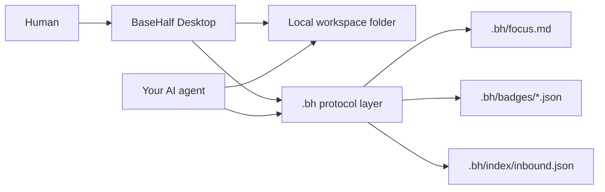

<p align="center">
  
</p>

> **Half AI. Half human. Half machine. Half flesh.**<br>
> **Building for agents and humans to do their best work.**

BaseHalf is an open-source, local-first desktop workspace for AI-assisted
knowledge work. It sits on top of a real folder, gives you a canvas, block
editor, file graph, and agent-readable `.bh/` context, so your own AI agent can
work from the same materials you see.

<div align="center">

[![Discussions][badge-discussions]][discussions]
[![Twitter / X][badge-twitter]][twitter]
[![Discord][badge-discord]][discord]
[![QQ Users][badge-qq-users]][qq-users]
[![QQ Dev][badge-qq-developers]][qq-developers]

[![Web Version][badge-website]][website]
[![GitCGR][badge-gitcgr]][gitcgr]
[![Apache-2.0][badge-license]][license]

</div>

**Status:** pre-alpha, dogfood-ready. The CLI, local protocol, and Electron Mac
app are usable today and still changing quickly.

Bring your own agent: **Codex**, **Claude Code**, **OpenClaw**,
**Hermes Agent**, or any other agent that can read and write local files.

BaseHalf is being built in public. Star the repo, open a discussion, or join the
community if you're exploring local-first, AI-native workspaces.

---

## Why BaseHalf

BaseHalf gives a local project a shared working surface for people and agents.
It turns a real folder into a visual workspace with files, notes, references,
prompts, and focus signals that stay close to the materials they describe.

Your files stay in a real folder. BaseHalf adds a `.bh/` layer beside them for
canvas positions, prompts, references, saved views, and the current focus signal.
Humans work through the desktop app. Agents read the same local protocol and
decide what context to load.

The result is a local workspace your existing agent can understand: a canvas for
you, plain files for the agent, and a small protocol that helps both sides stay
oriented.

## What It Is

- A **desktop workspace**: Electron, Mac first, with a file tree, canvas,
  previews, and a block editor over local files.
- A **local folder model**: your files stay where they are; `.bh/` stores
  BaseHalf metadata that can travel with the folder.
- An **agent-readable protocol**: `.bh/focus.md`, `.bh/badges/<file>.json`, and
  `.bh/index/inbound.json` publish the graph through plain local files.
- A **bring-your-own-agent tool**: you choose the agent. Codex, Claude Code,
  OpenClaw, Hermes Agent, or any file-reading agent can participate.
- A **standalone local app**: also useful as a knowledge workspace on its own.

## How It Works



A **badge** is a file plus a small backpack of metadata: prompt, references,
canvas position, and view-specific placement. Badges are materialized
automatically when you open a workspace.

The protocol is deliberately simple:

- `.bh/focus.md` says what you are focusing on this turn.
- `.bh/badges/<file>.json` describes each file's agent-facing prompt,
  references, and canvas metadata.
- `.bh/index/inbound.json` is a derived reverse-reference index.

BaseHalf publishes structure; the agent chooses what to read.

## What Works Today

BaseHalf is pre-alpha and the core loop is usable:

- Register a real folder as a workspace.
- See files and folders as badges on a canvas.
- Drag badges, persist positions, and scope into folder sub-canvases.
- Add references between badges.
- Preview and edit Markdown via BlockNote, with guardrails for lossy
  round-trips.
- Preview images, audio, video, PDFs, and plain code/text files.
- Save compound views and publish the current focus for agents.
- Keep `.bh/` metadata reconciled as files are added, renamed, or removed.

Core modules currently ship for:

- `workspace` - register, switch, rename, repath, and inspect workspaces.
- `badge` - read/write prompts, references, kind, and canvas metadata.
- `inbound` - query and rebuild reverse references.
- `focus` - publish the agent focus signal.
- `view` - create saved compound views.
- `watcher` - reconcile external filesystem changes.

## Quickstart

Requirements: Node >= 20.19 and pnpm 9.

```bash
pnpm install
pnpm -r build
pnpm -r test
```

Link the CLI globally:

```bash
cd packages/cli
npm link
```

Create or register a workspace:

```bash
bh init
bh workspace add ~/Desktop/my-notes --name notes --setup
bh workspace list --json
bh workspace use notes
bh workspace current --json
```

Work with the protocol:

```bash
bh badge list --json
bh badge set chapter-03.md --prompt "explain supply and demand simply"
bh badge addRef chapter-03.md textbook.pdf --note "source chapter"
bh inbound get textbook.pdf --json
bh focus set --files chapter-03.md,textbook.pdf
bh view create "Exam review"
bh view addMember exam-review chapter-03.md --x 100 --y 200
```

Create a demo workspace:

```bash
bh workspace demo ~/BaseHalf-Demo
```

Run the desktop app:

```bash
pnpm --filter @basehalf/desktop dev
```

## Repo Layout

```text
packages/
  core/             kernel + first-party modules
    src/
      index.ts        createCore() - the one door
      kernel/         registry, context, fs abstraction, command types
      modules/
        workspace/    workspace registry + local file access
        badges/       file/folder badges + references + canvas metadata
        inbound/      derived reverse-reference index
        focus/        .bh/focus.md publication
        views/        saved compound views
        watcher/      chokidar reconciliation for local filesystem changes
  cli/              bh - thin shell over @basehalf/core
  desktop/          Electron + React shell over core via IPC
docs/             decisions, dependency policy, trademark policy
```

## Architecture Principles

1. **One door.** All operations go through `@basehalf/core`'s
   `run(command, args)`. CLI, MCP, and desktop UI stay thin.
2. **Module isolation.** Modules live under `packages/core/src/modules/<name>/`
   and compose through `ctx.run`.
3. **Use the context filesystem.** Core modules use `ctx.fs`, so tests can swap
   in a mock implementation.
4. **Markdown is content truth.** User files remain the source; `.bh/` is
   metadata and derived cache.
5. **Publish simple local context.** BaseHalf writes a small protocol to disk so
   agents can navigate the workspace from the same folder.
6. **Composable primitives.** BaseHalf exposes small operations for workspaces,
   badges, references, focus, views, and filesystem reconciliation.

## Designed For

- **Agent-assisted reading and writing:** keep source files, notes, prompts, and
  references connected in one local workspace.
- **Research maps:** arrange files on a canvas, connect supporting materials,
  and save focused views for later work.
- **Project memory:** keep the current focus, file-level prompts, and reference
  graph beside the project itself.
- **Local-first collaboration with agents:** let Codex, Claude Code, OpenClaw,
  Hermes Agent, or another file-reading agent use the same folder structure you
  are using.

## Community

Community links are intentionally lightweight while BaseHalf is early:

- [GitHub Discussions][discussions] - questions, ideas, and build-in-public
  updates.
- [Twitter / X][twitter] - short public progress notes.
- [Discord][discord] - async community chat.
- [QQ Users][qq-users] - Chinese user community.
- [QQ Developers][qq-developers] - Chinese developer community.

If you are trying BaseHalf with Codex, Claude Code, OpenClaw, Hermes Agent, or
another local-file agent, we would love to hear what you build.

## Contributing

BaseHalf is early and deliberately narrow. Please open an issue or discussion
before sending a non-trivial PR so we can align on scope first.

1. Read [CONTRIBUTING.md][contributing] for build/test commands and architecture
   invariants.
2. Open a PR; CI runs the project checks.
3. Sign the [CLA][cla] when prompted. Contributions must use
   permissively-licensed dependencies.

Bug reports, ideas, and discussion are always welcome.

By participating you agree to our [Code of Conduct][code-of-conduct].

## License

[Apache-2.0][license]. Contributions require a signed [CLA][cla].

The "BaseHalf" name and logo are trademarks of Pointa Labs, Inc. See the
[trademark policy][trademark-policy].

[website]: https://basehalf.com
[gitcgr]: https://gitcgr.com/Pointa-Labs/basehalf
[discussions]: https://github.com/Pointa-Labs/basehalf/discussions
[twitter]: https://x.com/JustJerry121
[discord]: https://discord.gg/55wqkN9tPg
[qq-users]: https://qm.qq.com/q/hNq8D39YPe
[qq-developers]: https://qm.qq.com/q/LTidm8fKCc
[contributing]: CONTRIBUTING.md
[cla]: CLA.md
[code-of-conduct]: CODE_OF_CONDUCT.md
[license]: LICENSE
[trademark-policy]: docs/trademark-policy.md

[badge-website]: https://img.shields.io/badge/Web%20Version-basehalf.com-111827?style=flat-square
[badge-gitcgr]: https://img.shields.io/badge/GitCGR-BaseHalf-111827?style=flat-square
[badge-discussions]: https://img.shields.io/badge/Discussions-GitHub-24292F?style=flat-square&logo=github&logoColor=white
[badge-twitter]: https://img.shields.io/badge/Twitter%20%2F%20X-Follow-111111?style=flat-square&logo=x&logoColor=white
[badge-discord]: https://img.shields.io/badge/Discord-Join-5865F2?style=flat-square&logo=discord&logoColor=white
[badge-qq-users]: https://img.shields.io/badge/QQ%20Users-Join-12B7F5?style=flat-square
[badge-qq-developers]: https://img.shields.io/badge/QQ%20Dev-Join-12B7F5?style=flat-square
[badge-license]: https://img.shields.io/badge/License-Apache--2.0-2F855A?style=flat-square
