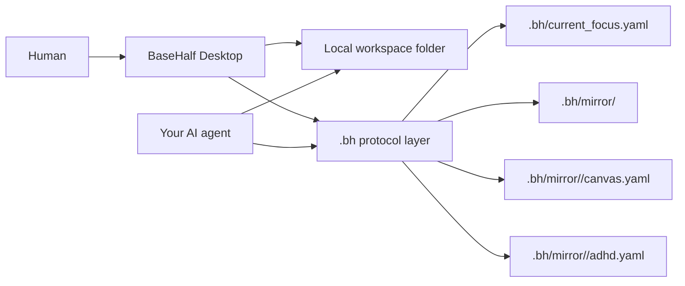

<p align="center">
  
</p>

> **Half AI. Half human. Half machine. Half flesh.**<br>
> **Building for agents and humans to do their best work.**

BaseHalf is an open-source, local-first desktop workspace for AI-assisted
knowledge work. It sits on top of a real folder, gives you a canvas, block
editor, file graph, and agent-readable `.bh/` context, so your own AI agent can
work from the same materials you see.

<div align="center">

[![Discussions][badge-discussions]][discussions]
[![Twitter / X][badge-twitter]][twitter]
[![Discord][badge-discord]][discord]
[![QQ Groups][badge-qq-groups]][community]

[![Web Version][badge-website]][website]
[![GitCGR][badge-gitcgr]][gitcgr]
[![Apache-2.0][badge-license]][license]

</div>

**Status:** pre-alpha, dogfood-ready. The local protocol and Electron Mac app
are usable today and still changing quickly.

Bring your own agent: **Codex**, **Claude Code**, **OpenClaw**,
**Hermes Agent**, or any other agent that can read and write local files.

BaseHalf is being built in public. Star the repo, open a discussion, or join the
community if you're exploring local-first, AI-native workspaces.

---

## Why BaseHalf

BaseHalf gives a local project a shared working surface for people and agents.
It turns a real folder into a visual workspace with files, notes, references,
prompts, and focus signals that stay close to the materials they describe.

Your files stay in a real folder. BaseHalf adds a `.bh/` mirror layer beside
them for descriptions, references, canvas positions, and the node the user is
currently looking at. Humans work through the desktop app. Agents read the same
local protocol and decide what context to load.

The result is a local workspace your existing agent can understand: a canvas for
you, plain files for the agent, and a small protocol that helps both sides stay
oriented.

## What It Is

- A **desktop workspace**: Electron, Mac first, with a file tree, canvas,
  previews, and a block editor over local files.
- A **local folder model**: your files stay where they are; `.bh/` stores
  BaseHalf metadata that can travel with the folder.
- An **agent-readable protocol**: a `.bh/mirror/` tree of plain YAML files —
  `.bh/current_focus.yaml` plus per-node `badge.yaml`, `canvas.yaml`,
  `focus.yaml`, and `adhd.yaml` — publishes the graph and the current focus.
- A **bring-your-own-agent tool**: you choose the agent. Codex, Claude Code,
  OpenClaw, Hermes Agent, or any file-reading agent can participate.
- A **standalone local app**: also useful as a knowledge workspace on its own.

## How It Works



A **badge** is a file or folder plus a small backpack of metadata: a one-line
description and references to other nodes. Badges are a sparse overlay, created
lazily the first time you annotate a node — a fresh workspace has none, and the
canvas reads the filesystem directly and overlays only the badges that exist.

The protocol is a per-node mirror tree, deliberately simple:

- `.bh/current_focus.yaml` is a symlink to the `focus.yaml` of the node you are
  looking at right now — the agent's per-turn entry point.
- `.bh/mirror/<path>/badge.yaml` describes a node's one-line description,
  outbound `references`, and the embedded inbound `referenced_by` index.
- `.bh/mirror/<folder>/canvas.yaml` holds a folder's card positions and the
  edges (with anchors + labels) between its children.
- `.bh/mirror/<path>/focus.yaml` mirrors a node's viewport (which line / cursor
  for a file, pan center / zoom for a folder canvas).
- `.bh/mirror/<file>/adhd.yaml` carries per-file reading aids: highlight
  keywords and already-read line-ranges.

BaseHalf publishes structure; the agent chooses what to read.

## What Works Today

BaseHalf is pre-alpha and the core loop is usable:

- Register a real folder as a workspace.
- See files and folders as badges on a canvas.
- Drag badges, persist positions, and scope into folder sub-canvases.
- Add references between badges.
- Preview and edit Markdown via BlockNote, with guardrails for lossy
  round-trips.
- Preview images, audio, video, PDFs, and plain code/text files.
- Mirror the node you're looking at into `.bh/current_focus.yaml` for agents.
- Keep `.bh/` metadata reconciled as files are added, renamed, or removed.

Core modules currently ship for:

- `workspace` - register, switch, rename, repath, and inspect workspaces.
- `badges` - read/write a node's description and references (with the inbound
  index embedded as `referenced_by`).
- `canvas` - per-folder card positions and edges (the visual layer).
- `focus` - mirror the user's current viewport (`focus.yaml` +
  `current_focus.yaml` symlink) for agents.
- `adhd` - per-file reading aids (highlight keywords + already-read ranges).
- `search` - full-text content search across the workspace.
- `watcher` - reconcile external filesystem changes.

## Quickstart

Requirements: Node >= 20.19 and pnpm 9.

```bash
pnpm install
pnpm -r build
pnpm -r test
```

Run the desktop app:

```bash
pnpm --filter @basehalf/desktop dev
```

From the app, **Open Folder** registers a real folder as a workspace (path is
identity — re-opening one just switches to it), scaffolds the `.bh/` mirror, and
installs the agent-protocol hint into the folder's `CLAUDE.md` + `AGENTS.md`.
The desktop app is the main product surface: renderer workbench parts talk to
Electron main-process services and provider-style integrations over narrow
protocols, following VS Code's architecture. The historical `@basehalf/core`
package remains for legacy package history/tests, but new desktop work should
not add business logic there merely to preserve the old "one door" shape. Your
agent reads the published `.bh/` mirror (starting from
`.bh/current_focus.yaml`) directly.

## Repo Layout

```text
packages/
  core/             legacy command registry + historical first-party modules
    src/
      index.ts        createCore() legacy command registry
      kernel/         registry, context, fs abstraction, mirror store, command types
      modules/
        workspace/    workspace registry + local file access
        badges/       file/folder badge.yaml (description + references + referenced_by)
        canvas/       per-folder canvas.yaml (card positions + edges)
        focus/        focus.yaml viewport mirror + current_focus.yaml symlink
        adhd/         per-file adhd.yaml reading aids
        search/       full-text content search over workspace files
        watcher/      chokidar reconciliation for local filesystem changes
  desktop/          Electron + React workbench, main-process services, providers
docs/             decisions, dependency policy, trademark policy
```

## Architecture Principles

1. **VS Code-shaped boundaries.** Prefer workbench/browser UI parts, renderer
   services, Electron main-process services, provider integrations, and narrow
   shared protocols over new desktop behavior in `@basehalf/core`.
2. **Provider isolation.** Source control, GitHub, workspace, mirror, settings,
   and search behavior should sit behind explicit service/provider interfaces
   that tests can replace.
3. **Legacy core stays stable.** Existing core modules may remain for package
   history and tests. When editing them, keep behavior stable and do not deepen
   desktop coupling to `ctx.run`.
4. **User files are content truth.** Your files remain the source; `.bh/` is the
   derived mirror (and `.bh/cache/` is rebuildable, gitignored).
5. **Publish simple local context.** BaseHalf writes a small YAML mirror to disk
   so agents can navigate the workspace from the same folder.
6. **Composable primitives.** BaseHalf exposes small operations for workspaces,
   badges, canvas, focus, reading aids, search, and filesystem reconciliation.

## Designed For

- **Agent-assisted reading and writing:** keep source files, notes, prompts, and
  references connected in one local workspace.
- **Research maps:** arrange files on a canvas, connect supporting materials,
  and focus a folder of supporting materials for later work.
- **Project memory:** keep the current focus, file-level descriptions, and
  reference graph beside the project itself.
- **Local-first collaboration with agents:** let Codex, Claude Code, OpenClaw,
  Hermes Agent, or another file-reading agent use the same folder structure you
  are using.

## Community

Community links are intentionally lightweight while BaseHalf is early:

- [GitHub Discussions][discussions] - questions, ideas, and build-in-public
  updates.
- [Twitter / X][twitter] - short public progress notes.
- [Discord][discord] - async community chat.
- [QQ Users][qq-users] - Chinese user community.
- [QQ Developers][qq-developers] - Chinese developer community.

If you are trying BaseHalf with Codex, Claude Code, OpenClaw, Hermes Agent, or
another local-file agent, we would love to hear what you build.

## Contributing

BaseHalf is early and deliberately narrow. Please open an issue or discussion
before sending a non-trivial PR so we can align on scope first.

1. Read [CONTRIBUTING.md][contributing] for build/test commands and architecture
   invariants.
2. Open a PR; CI runs the project checks.
3. Sign the [CLA][cla] when prompted. Contributions must use
   permissively-licensed dependencies.

Bug reports, ideas, and discussion are always welcome.

By participating you agree to our [Code of Conduct][code-of-conduct].

## License

[Apache-2.0][license]. Contributions require a signed [CLA][cla].

The "BaseHalf" name and logo are trademarks of Pointa Labs, Inc. See the
[trademark policy][trademark-policy].

[website]: https://basehalf.com
[gitcgr]: https://gitcgr.com/Pointa-Labs/basehalf
[discussions]: https://github.com/Pointa-Labs/basehalf/discussions
[twitter]: https://x.com/JustJerry121
[discord]: https://discord.gg/55wqkN9tPg
[community]: #community
[qq-users]: https://qm.qq.com/q/hNq8D39YPe
[qq-developers]: https://qm.qq.com/q/LTidm8fKCc
[contributing]: CONTRIBUTING.md
[cla]: CLA.md
[code-of-conduct]: CODE_OF_CONDUCT.md
[license]: LICENSE
[trademark-policy]: docs/trademark-policy.md

[badge-website]: https://img.shields.io/badge/Web%20Version-basehalf.com-9FBBE0?style=flat&labelColor=1A1A17
[badge-gitcgr]: https://img.shields.io/badge/GitCGR-BaseHalf-C0A8DD?style=flat&labelColor=1A1A17
[badge-discussions]: https://img.shields.io/badge/GitHub-Discussions-2D333B?style=flat&logo=github&logoColor=DBE7FB&labelColor=1A1A17
[badge-twitter]: https://img.shields.io/badge/X-Follow-2A2B2B?style=flat&logo=x&logoColor=DBE7FB&labelColor=1A1A17
[badge-discord]: https://img.shields.io/badge/Discord-Join-5865F2?style=flat&logo=discord&logoColor=DBE7FB&labelColor=1A1A17
[badge-qq-groups]: https://img.shields.io/badge/QQ-Groups-7EB8CD?style=flat&labelColor=1A1A17
[badge-license]: https://img.shields.io/badge/License-Apache--2.0-2A2B2B?style=flat&labelColor=1A1A17
