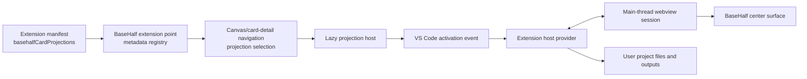

# BaseHalf plugin architecture

Status: implemented platform and local distribution path, 2026-07-13. This document defines the code
boundary introduced by D25–D29. It is the implementation map for maintainers
and plugin authors; the product decisions remain authoritative in
[`decisions.md`](decisions.md).

## Product contract

BaseHalf has a fixed shell and an open center. A plugin can feel like a game
mod—it may add a substantial project mode—but it runs inside BaseHalf's
navigation, file, trust, and lifecycle contracts.

| Concern | BaseHalf main program | Domain plugin |
| --- | --- | --- |
| Files, search, Git, dialogs, commands | Owns the VS Code-backed services | Consumes public extension APIs |
| Left sidebar and right Agent Area | Owns Files/Git/Search/Plugins and keeps the shell fixed | Cannot add competing product areas or Activity Bar entries |
| Canvas/card-detail navigation | Owns history, focus, fallback, projection picker | Contributes center/card projections |
| File truth | Opens and observes ordinary workspace files | Defines a documented domain file format |
| `.bh/mirror` | Owns derived BaseHalf context/focus state | Must not store domain truth there |
| Workflow semantics | Does not plan or orchestrate domain work | Validates and executes explicit domain actions |
| Agent/LLM decisions | Provides the container and user-selected Agents | May define its own disclosed AI strategy |
| Provider credentials and billing | Does not proxy or resell them | Connector/provider owns its integration |
| Extension admission | Owns curated catalog, allowlist, enablement, trust | Declares identity and contribution metadata |
| Uninstall/disable | Falls back to ordinary file/source behavior | Must leave project and outputs readable |

The main program must not accumulate per-domain orchestration. A new domain
belongs in a plugin unless it changes the fixed shell or a BaseHalf-wide file
contract.

## VS Code infrastructure reused

BaseHalf deliberately reuses the parts of VS Code that already solve trusted
desktop extension lifecycle:

- manifest discovery and `contributes` extension points;
- activation events and lazy extension-host startup;
- extension identifiers, enablement, workspace trust, and product allowlists;
- main-thread/extension-host RPC actors;
- webview isolation, CSP, resource roots, message transport, and lifecycle;
- commands, quick input, dialogs, workspace filesystem, file watchers, secrets,
  terminals, authentication, and progress APIs;
- packaged built-in extension compilation and distribution.

BaseHalf does not expose the generic Extensions/Marketplace product surface.
Its BaseHalf-owned Plugins view reuses the native Activity Bar/view-container,
the VS Code `Renderer`/`WorkbenchPagedList` extension-row UI, ActionBar/manage
dropdown, hover/focus behavior, menus, settings, and extension-management
infrastructure while reading only the product-owned curated catalog. BaseHalf
supplies a narrow action factory so the reused row can install only admitted,
signature-verified packages instead of calling Marketplace actions.
`BaseHalf: Manage Plugins` opens the central details surface for that same
catalog. Reviewed
domain-plugin payloads ship outside the system-extension scan directory and are
installed into the user's extension profile only on request. Executable plugins
remain trusted local software; the manifest is not advertised as an OS
permission sandbox.

## Runtime layers



The metadata and runtime registrations are intentionally separate. Manifest
metadata lets BaseHalf select and label a projection without activating plugin
code. Runtime registration occurs only after activation. Removing or disabling
the extension disposes both registrations; the card falls back to `source`.

Relevant implementation:

- metadata registry: `src/vs/workbench/basehalf/common/basehalfCardDetail.ts`
- surface registry: `src/vs/workbench/basehalf/browser/cardDetail/basehalfCardDetailSurface.ts`
- extension point: `src/vs/workbench/basehalf/browser/basehalfCardProjectionExtensionPoint.contribution.ts`
- lazy/restart-safe host: `src/vs/workbench/basehalf/browser/cardDetail/basehalfExtensionCardProjection.ts`
- RPC bridge: `src/vs/workbench/api/browser/mainThreadBaseHalf.ts` and
  `src/vs/workbench/api/common/extHostBaseHalf.ts`
- proposed author API: `src/vscode-dts/vscode.proposed.basehalfDomainPlugins.d.ts`
- curated catalog/manager: `src/vs/workbench/basehalf/common/basehalfPluginCatalog.ts`

## Plugin Library and lifecycle

Plugins is the fourth, BaseHalf-owned native Activity Bar view container beside
Files, Git, and Search. It provides searchable Installed/Available sections,
native VS Code extension rows and inline ActionBar lifecycle actions, native
row context menus, and extension-scoped Settings when a plugin contributes
configuration. Selecting a row opens one
singleton center `EditorPane` for full details, after flushing the currently
visible Card Detail projection; closing it returns to the unchanged Canvas/Card
Detail state. The same command remains in Preferences and the command palette.
This does not authorize individual plugins to add Activity Bar entries.

`IBaseHalfPluginCatalogService` merges three sources without relaxing client
admission: the built-in curated list, the last signature-verified cached
catalog, and the current signature-verified remote catalog.
`IBaseHalfPluginManagementService` is the only product-facing lifecycle path.
It serializes operations per extension and delegates install, enable, disable,
update, uninstall, profiles, scanning, and Extension Host changes to VS Code.
The Library renders `available`, `installing`, `enabled`, `disabled`,
`updateAvailable`, `updating`, `incompatible`, `withdrawn`, and `error` states.

The generic Extensions view, Marketplace search, and arbitrary VSIX UI remain
hidden. An uninstall confirmation explicitly states that local project and
generated output files are not deleted.

## Signed catalog wire contract

Catalog v1 contains `schemaVersion`, a monotonically increasing `sequence`,
`generatedAt`, and plugin/version entries. A version fixes the BaseHalf and VS
Code compatibility ranges, target platform, relative immutable asset path,
SHA-256, size, publication time, and active/withdrawn state. The detached
signature names a client-known key and uses `ECDSA_P256_SHA256_DER`.

The client verification path is intentionally fail-closed:

1. fetch one short-cache catalog index without blocking startup;
2. require it to point to the catalog and detached signature under one immutable
   `catalogs/<sequence>/` prefix on the same HTTPS origin;
3. verify the signature over the exact UTF-8 catalog bytes and require the
   catalog sequence to equal the index sequence;
4. reject schema errors, sequence rollback, and same-sequence content changes;
5. ignore extension IDs not admitted by this client build;
6. select a compatible active version;
7. resolve only a relative asset path under the configured HTTPS origin;
8. download to a temporary file and verify length and SHA-256;
9. verify the VSIX manifest ID and version;
10. hand the VSIX to VS Code's profile installer and always clean the temporary file.

Offline mode can display installed plugins and the last verified catalog. It
never installs a package learned only from an unverified or failed response.

## Release and infrastructure

`scripts/basehalf-plugin-release.mts` packages AI Video with the fixed
`@vscode/vsce` version, creates/updates the catalog, handles withdrawal and
rollback, and verifies a release from HTTP/CDN through its real VSIX manifest.
`scripts/basehalf-plugin-fixture.mts` runs the same path against a local HTTP
fixture and covers tampering, wrong identity/version, timeout, offline, and
sequence rollback.

`.github/workflows/publish-plugins.yml` uploads immutable digest-addressed VSIX
objects, signs the catalog digest with AWS KMS P-256, publishes versioned and
short-cache atomic catalog index, invalidates CloudFront, and downloads the
immutable result again for staging verification. The index is the only mutable
catalog object, so clients cannot pair a new signature with an old catalog.
`infrastructure/plugins/` defines the
private S3 bucket, CloudFront OAC/distribution, KMS key, DNS option, and
least-privilege GitHub OIDC publisher role. It is isolated from the current
EC2/Gateway/PostgreSQL/Redis web application stack.

Ordinary withdrawal is catalog-version scoped. A security withdrawal also
publishes a small BaseHalf-owned `extensions-control.json`; VS Code's existing
control-manifest parser and malicious-extension enforcement merges it with the
Open VSX control list. Each endpoint is fetched independently: an Open VSX or
Raw GitHub outage cannot suppress BaseHalf's emergency blocklist, and a
BaseHalf endpoint outage cannot erase the upstream protection.

Production packaging requires the provisioned KMS public key through
`BASEHALF_PLUGIN_CATALOG_KEY_ID` and
`BASEHALF_PLUGIN_CATALOG_PUBLIC_KEY_PATH`. The package task validates that the
key is P-256 and stamps its PEM SPKI into `product.json`; it refuses to produce
an application package with an empty keyring. Supported clients retain old
public keys during rotation. Local source builds may keep the checked-in empty
keyring and use bundled on-demand payloads.

## Manifest and API contract

A domain plugin declares projections before registering providers:

```json
{
  "enabledApiProposals": ["basehalfDomainPlugins"],
  "contributes": {
    "basehalfCardProjections": [{
      "id": "publisher.extension.project",
      "label": "Project",
      "icon": "layout",
      "extensions": [".project"],
      "order": 400,
      "defaultPriority": 400
    }]
  }
}
```

The projection ID must be prefixed by the full extension ID. File selectors are
explicit suffixes; no plugin can claim every file. A provider then calls
`vscode.basehalf.registerCardProjectionProvider`. It receives the resource, a
BaseHalf-owned view lifecycle, a VS Code webview, and cancellation. The API is
proposed until more than one official plugin validates it; changes are allowed
before it is promoted to a stable public API.

Dynamic registration/unregistration is supported. The host rejects duplicate
IDs, validates manifest ownership, cancels work when the card closes, and
reconnects the visible projection after an extension-host restart.

## Local data and workflow rules

Plugin projects and workflow outputs are ordinary user files. An explicit UI
or Agent action may write them. Background discovery, rendering, and indexing
must not silently modify project content. Plugins should use portable relative
paths for child artifacts and conflict-check before overwriting an externally
changed project.

Plugin-private storage is appropriate only for disposable caches and UI state,
never for the only copy of a project or generated artifact. Provider secrets
belong in VS Code secret storage or the provider's own authenticated service;
they never belong in the project file.

The workflow graph is domain data. BaseHalf reference edges remain explicit
context-flow relations and Markdown links remain navigation. A domain plugin
must not infer either relationship from its workflow nodes or edges.

## AI Video reference plugin

`extensions/basehalf-ai-video` proves the complete contract:

- `.aivideo` is versioned, readable JSON containing script, characters,
  scenes, shots, provider choices, status, and relative output paths;
- the center projection edits the project without opening an editor tab;
- Save and Run are explicit writes with disk-revision conflict checks;
- unsaved plugin state participates in BaseHalf's navigation preflight, so a
  card cannot close or switch until the plugin saves or discards it;
- external Agent edits reload automatically when clean and surface a conflict
  when the webview has unsaved work;
- Run supports progress, cancellation, per-shot errors, and local outputs;
- the built-in `prompt-package` provider produces a deterministic local request
  package, not fake generated media;
- video/voice services extend the plugin through provider registrations rather
  than being hard-coded into BaseHalf core;
- no timeline editor, compositor, or final-cut surface is included.

## Admission and evolution

The first product profile admits only BaseHalf's built-in source-control/Agent
families and explicitly listed official domain plugins. Adding a plugin requires
all of the following in one reviewed change:

1. add its exact extension ID to `BASEHALF_ALLOWED_EXTENSION_FAMILIES`;
2. add a curated catalog entry if it is user-facing;
3. verify its manifest ID prefix and file selectors;
4. document its durable local file format and disable/uninstall behavior;
5. disclose network/provider behavior and credential storage;
6. add compile, unit, and Electron smoke coverage.

A public Marketplace, arbitrary Node plugin installation, paid distribution,
ratings, and unattended cloud execution remain separate future product
decisions. The architecture does not require them and does not falsely imply
that they are already supported.
