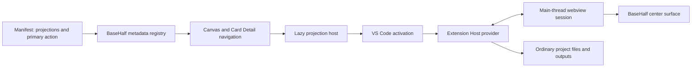

# BaseHalf plugin architecture

Status: implemented platform and curated publishing path, 2026-07-14. This is
the implementation map for decisions D25–D30. Product decisions in
[`decisions.md`](decisions.md) remain authoritative.

## Product contract

BaseHalf has a fixed shell and an open center. A plugin may add a substantial
project mode, but it stays inside BaseHalf's navigation, data, trust, and
lifecycle contracts.

| Concern | BaseHalf main program | Domain plugin |
| --- | --- | --- |
| Files, search, Git, dialogs, commands | Owns VS Code-backed services | Consumes public extension APIs |
| Global product surfaces | Owns Files/Git/Search/Plugins and Agent Area | Cannot add competing Activity Bar or panel areas |
| Center navigation | Owns Canvas, Card Detail, history, focus, and fallback | Contributes center/card projections |
| File truth | Opens and observes ordinary workspace files | Defines a documented local domain format |
| `.bh/mirror` | Owns derived context/focus state | Must not store domain truth there |
| Workflow semantics | Does not plan domain work | Validates and executes explicit domain actions |
| Agent decisions | Hosts user-selected Agents | May define a disclosed AI strategy |
| Model credentials | Stores global connections and secrets | Requests reviewed capabilities at run time |
| Billing and provider policy | Does not resell usage or decide policy | Makes the disclosed request with the user's account |
| Admission | Owns official admission and signed Publisher grants | Declares owned identity, primary action, and compatibility |
| Disable/uninstall | Falls back to ordinary file/source behavior | Leaves projects and outputs readable |

The main program must not accumulate per-domain orchestration. A new domain
belongs in a plugin unless it changes the fixed shell or a BaseHalf-wide file
contract.

## VS Code infrastructure reused

BaseHalf reuses the VS Code extension host, manifest discovery, activation,
profiles, enablement, workspace trust, webview isolation, commands, quick input,
dialogs, filesystem, watchers, secrets, terminals, authentication, progress,
settings, and extension-management lifecycle.

The generic Extensions/Marketplace surface stays hidden. BaseHalf's Plugins
entry is the fourth native Activity Bar view beside Files, Git, and Search. It
reuses VS Code's extension-row renderer, paged list, ActionBar, manage menu,
context menu, settings, enable/disable/uninstall, runtime-state actions, and
**Restart to Update** behavior, but reads only BaseHalf's curated catalog.
Individual plugins cannot add their own global sidebars.

Executable plugins are trusted local software. The manifest is not represented
as an operating-system permission sandbox.

## Runtime layers



Manifest metadata lets BaseHalf label/select a projection without activating
plugin code. Runtime registration happens after activation. Disabling,
uninstalling, or restarting the Extension Host disposes and reconnects
registrations; an unavailable projection falls back to `source`.

Relevant implementation:

- metadata registry: `src/vs/workbench/basehalf/common/basehalfCardDetail.ts`
- projection host: `src/vs/workbench/basehalf/browser/cardDetail/basehalfExtensionCardProjection.ts`
- RPC bridge: `src/vs/workbench/api/browser/mainThreadBaseHalf.ts` and
  `src/vs/workbench/api/common/extHostBaseHalf.ts`
- stable API: `src/vscode-dts/vscode.d.ts` under `vscode.basehalf`
- catalog: `src/vs/workbench/basehalf/common/basehalfPluginCatalog.ts`
- lifecycle: `src/vs/workbench/basehalf/common/basehalfPluginManagementService.ts`

## Plugin Library and lifecycle

Selecting a plugin row opens one singleton center `EditorPane` with details,
Publisher/trust metadata, versions, release notes, and lifecycle actions. The
current Card Detail projection is flushed first; unresolved dirty state blocks
the switch. Closing the system page restores the unchanged Canvas/Card Detail
state and never creates a workspace file or ordinary editor tab.

`IBaseHalfPluginCatalogService` merges the built-in official catalog, the last
verified cache, and the current verified remote catalog. The client trusts
official IDs compiled into the product and reviewed Publisher namespaces
granted by the signed catalog. A remote entry cannot impersonate an official ID
or change Publisher ownership.

`IBaseHalfPluginManagementService` is the only product lifecycle path. It
serializes operations per extension and delegates profile install, scan,
enable, disable, update, uninstall, and Extension Host changes to VS Code. The
Library renders `available`, `installing`, `enabled`, `disabled`,
`updateAvailable`, `updating`, `incompatible`, `withdrawn`, and `error` states.
Updates are explicit and uninstall confirmation states that local files remain.

## Signed catalog wire contract

Catalog v1 contains `schemaVersion`, monotonically increasing `sequence`,
`generatedAt`, and plugin/version entries. A version fixes compatibility,
platform, relative immutable asset path, SHA-256, byte size, publication time,
status, Publisher trust, primary action, and release notes. The detached
signature names a client-known key and uses `ECDSA_P256_SHA256_DER`.

The client verification path is fail-closed:

1. fetch the short-cache index without blocking startup;
2. require catalog and signature under one immutable
   `catalogs/<sequence>/` prefix on the configured HTTPS origin;
3. verify the signature over exact catalog bytes and index/sequence agreement;
4. reject schema errors, rollback, or same-sequence content changes;
5. admit only a compiled official ID or reviewed Publisher identity in the
   signed catalog;
6. select a compatible, active version;
7. reject absolute URLs, traversal, invalid identities, and oversized data;
8. download to a temporary file and verify size and SHA-256;
9. verify VSIX manifest ID and version;
10. hand the VSIX to VS Code's profile installer and clean the temporary file.

Catalog responses, entry counts, version counts, strings, and assets have hard
limits. Offline mode can show installed plugins and the last verified cache but
never installs a package learned from a failed or unverified response.

## Publishing control plane

Developers use their existing Basehalf web account. A user creates or joins one
Publisher, accepts the current CLA and publishing terms, and owns plugin IDs in
that Publisher namespace. There is no separate developer identity.

The `bh-plugin` CLI uses an OAuth-style device flow. Its opaque, expiring token
is Publisher-scoped and stored in an owner-only local file. Publication is split
from signing:

1. the CLI validates, packages, hashes, and requests an upload grant;
2. the VSIX goes directly to a private quarantine bucket;
3. the server reads it back and checks hash/size, ZIP safety, identity/version,
   engines, contribution boundaries, primary action, README, and license;
4. a reviewer downloads the exact candidate and records approval or rejection;
5. approval creates an immutable release job;
6. a separately credentialed signer leases that job, repeats critical checks,
   publishes by digest, advances the KMS-signed catalog, and verifies the CDN;
7. the control plane records the result and desktop clients discover it.

Quarantine is private and not a CloudFront origin. Reviewers cannot sign, the
web service cannot use KMS, and the signer cannot approve. Review reduces
supply-chain risk but does not turn executable code into sandboxed code.

## Release infrastructure

`scripts/basehalf-plugin-release.mts` handles arbitrary approved plugin jobs,
immutable asset paths, catalog creation, withdrawal/rollback, and HTTP/CDN
verification. Official AI Video uses the same generic release path as a
reviewed community plugin.

`.github/workflows/publish-plugins.yml` publishes official releases.
`.github/workflows/promote-reviewed-plugin.yml` leases reviewed jobs. Both
publish an immutable catalog/signature pair, atomically update the only mutable
short-cache index, invalidate CloudFront, and verify the result. CI uses the
fixed `@vscode/vsce` version and a non-exportable AWS KMS P-256 key.

`infrastructure/plugins/` defines private distribution and quarantine buckets,
CloudFront OAC/distribution, KMS, DNS options, and least-privilege GitHub OIDC
and EC2 roles. Quarantine access is isolated from the public distribution
origin. Published VSIX objects are never overwritten. Rollback and withdrawal
always advance the catalog sequence. Before a new catalog becomes current, the
signer synchronizes that plugin's active-version set back to the control plane
so portal and desktop discovery cannot disagree.

Normal withdrawal blocks new installs and shows a reason. Security withdrawal
also publishes a BaseHalf extension-control document consumed by VS Code's
existing malicious-extension enforcement.

Production packaging requires a provisioned public key through
`BASEHALF_PLUGIN_CATALOG_KEY_ID` and
`BASEHALF_PLUGIN_CATALOG_PUBLIC_KEY_PATH`; it refuses an empty production
keyring. Supported clients retain old public keys during rotation.

## Manifest and stable host API

```json
{
  "publisher": "publisher",
  "name": "extension",
  "engines": {
    "vscode": "^1.100.0",
    "basehalf": ">=0.1.0"
  },
  "basehalf": {
    "primaryCommand": "publisher.extension.createProject",
    "primaryCommandLabel": "Create Project…"
  },
  "contributes": {
    "commands": [{
      "command": "publisher.extension.createProject",
      "title": "Create Project…"
    }],
    "basehalfCardProjections": [{
      "id": "publisher.extension.project",
      "label": "Project",
      "icon": "layout",
      "extensions": [".project"],
      "order": 400,
      "defaultPriority": 400
    }]
  }
}
```

Command and projection IDs must be prefixed by the full extension ID. Selectors
use explicit suffixes; no plugin can claim every file. A provider calls
`vscode.basehalf.registerCardProjectionProvider` and receives the resource,
BaseHalf-owned view lifecycle, webview, dirty-state control, and cancellation.
The contract is stable and mirrored by `@basehalf/plugin-sdk`.

Global model connections are another stable host capability. Reviewed plugins
use `getModelServices(capability)` for discovery and request a connection
snapshot only when an explicit run needs it. Keys remain in application-global
encrypted secret storage and must never enter project data, logs, webview
messages, or plugin persistence.

## Local data and workflow rules

Plugin projects and outputs are ordinary user files. Explicit user or Agent
actions may write them; background discovery/rendering must not. Use portable
relative paths and conflict-check before overwriting external changes.
Extension-private storage is only for disposable caches and UI state.

The plugin workflow graph is domain data. BaseHalf reference edges remain
explicit context-flow relations, and Markdown links remain navigation. A plugin
must not infer either from workflow nodes or edges.

## Developer entry point and evolution

The supported path is [`plugin-development.md`](plugin-development.md):
scaffold with `bh-plugin`, use the stable SDK, authenticate with the same
Basehalf account, publish to quarantine, pass review, and receive updates
through the signed catalog. Community plugins do not require client source
changes.

This remains curated, not a generic Marketplace. Arbitrary Node/VSIX install,
instant self-publication, payments, ratings, and unattended cloud execution are
separate product decisions.
