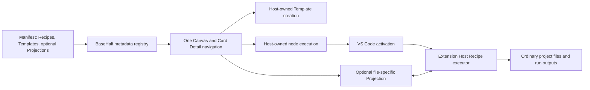

# BaseHalf plugin architecture

Status: implemented platform and curated publishing path, 2026-07-18. This is
the implementation map for decisions D25–D33. Product decisions in
[`decisions.md`](decisions.md) remain authoritative.

## Product contract

BaseHalf has a fixed shell and one extensible main canvas. A plugin may add
substantial domain capabilities to that canvas, but it stays inside BaseHalf's
navigation, data, trust, and lifecycle contracts.

| Concern | BaseHalf main program | Domain plugin |
| --- | --- | --- |
| Files, search, Git, dialogs, commands | Owns VS Code-backed services | Consumes public extension APIs |
| Global product surfaces | Owns Files/Git/Search/Plugins and Agent Area | Cannot add competing Activity Bar or panel areas |
| Center navigation | Owns Canvas, Card Detail, history, focus, and fallback | Contributes Recipes and Templates; may opt in to a file-specific Card Detail Projection |
| File truth | Opens and observes ordinary workspace files | Uses ordinary files and may document additional local formats |
| `.bh/mirror` | Owns derived context/focus state | Must not store domain truth there |
| Content and execution | Owns the primary node graph plus Recipe, Run, Current, History, and direct-context semantics | Contributes domain recipes, templates, input roles, validation, and executors |
| Agent decisions | Hosts user-selected Agents | May define a disclosed AI strategy |
| Model credentials | Stores global connections and secrets | Requests reviewed capabilities at run time |
| Billing and provider policy | Does not resell usage or decide policy | Makes the disclosed request with the user's account |
| Admission | Owns official admission and signed Publisher grants | Declares owned identity, primary action, and compatibility |
| Disable/uninstall | Falls back to ordinary file/source behavior | Leaves projects and outputs readable |

The main program must not accumulate per-domain orchestration. A new domain
belongs in a plugin unless it changes the fixed shell or a BaseHalf-wide file
contract.

There is one primary canvas model, not one canvas per plugin. Text, code, files,
folders, images, video, audio, PDF, and presentations remain stable content
nodes; execution is an optional capability on those nodes. A plugin may teach
the canvas how to perform a domain action, but it cannot duplicate the canvas,
invent a second execution lifecycle, or replace BaseHalf's edge semantics.

## VS Code infrastructure reused

BaseHalf reuses the VS Code extension host, manifest discovery, activation,
profiles, enablement, workspace trust, webview isolation, commands, quick input,
dialogs, filesystem, watchers, secrets, terminals, authentication, progress,
settings, and extension-management lifecycle.

The generic Extensions/Marketplace surface stays hidden. BaseHalf's Plugins
entry is the fourth native Activity Bar view beside Files, Git, and Search. It
reuses VS Code's extension-row renderer, paged list, ActionBar, manage menu,
context menu, settings, enable/disable/uninstall, runtime-state actions, and
update-related restart behavior, but reads only BaseHalf's curated catalog.
Individual plugins cannot add their own global sidebars.

Executable plugins are trusted local software. The manifest is not represented
as an operating-system permission sandbox.

## Runtime layers



Manifest metadata lets BaseHalf present Recipes, validate and create Templates,
and select an optional Projection without activating plugin code. Recipe
execution and Projection provider registration happen after activation.
Disabling, uninstalling, or restarting the Extension Host disposes and
reconnects registrations; user files and host-owned Current/History remain, and
an unavailable Projection falls back to `source`.

For an explicit node Run, the host writes the immutable running record before
fallible provider or input preparation. A local deterministic Recipe records
`source: local`. A model-backed Recipe records its stable service id, explicit
model id when supplied, capability, display label, and a digest of the
non-secret request-affecting connection settings. If the selected connection
cannot be resolved, History records an honest unavailable service attempt and
the Run fails without invoking the executor. The endpoint and API key never
enter project data. Changing connection settings after a resolved snapshot
causes credential access to fail closed; rotating only the secret remains
allowed. Successful Runs may additionally store a bounded provider request id,
structured usage, and decimal-string cost. Failed, cancelled, and interrupted
Runs keep their frozen model selection and never replace the prior Current.

Relevant implementation:

- metadata registry: `src/vs/workbench/basehalf/common/basehalfCardDetail.ts`
- projection host: `src/vs/workbench/basehalf/browser/cardDetail/basehalfExtensionCardProjection.ts`
- RPC bridge: `src/vs/workbench/api/browser/mainThreadBaseHalf.ts` and
  `src/vs/workbench/api/common/extHostBaseHalf.ts`
- stable API: `src/vscode-dts/vscode.d.ts` under `vscode.basehalf`
- catalog: `src/vs/workbench/basehalf/common/basehalfPluginCatalog.ts`
- lifecycle: `src/vs/workbench/basehalf/common/basehalfPluginManagementService.ts`

### D33 implementation map

The unified content-and-execution decision is implemented across narrow host
boundaries rather than inside a domain plugin:

- result document parsing and Current/History truth:
  `src/vs/workbench/basehalf/common/basehalfNodeDocument.ts`;
- Recipe and Template registries:
  `src/vs/workbench/basehalf/common/basehalfCanvasRecipes.ts` and
  `src/vs/workbench/basehalf/common/basehalfCanvasTemplate.ts`;
- host-owned Run, cancellation, integrity, and recovery:
  `src/vs/workbench/basehalf/browser/basehalfNodeExecutionService.ts`;
- card state and temporary Edit/History surface:
  `src/vs/workbench/basehalf/browser/basehalfCanvasWorkbench.contribution.ts`
  and `src/vs/workbench/basehalf/browser/basehalfNodeLocalSurface.ts`;
- reviewed extension metadata and executor registration:
  `src/vs/workbench/basehalf/browser/basehalfCanvasRecipeExtensionPoint.contribution.ts`
  plus `src/vs/workbench/api/browser/mainThreadBaseHalf.ts` and
  `src/vs/workbench/api/common/extHostBaseHalf.ts`;
- the first domain capability pack:
  `extensions/basehalf-ai-video/`, which contributes only Recipes, a Template,
  Agent document contracts, deterministic commands, and matching executors.

## Plugin Library and lifecycle

Selecting a plugin row opens one singleton center `EditorPane` with details,
Publisher/trust metadata, versions, release notes, and lifecycle actions. The
current Card Detail projection is flushed first; unresolved dirty state blocks
the switch. Closing the system page restores the unchanged Canvas/Card Detail
state and never creates a workspace file or ordinary editor tab.

`IBaseHalfPluginCatalogService` merges the built-in official catalog, the last
verified cache, and the current verified remote catalog. The client trusts
official IDs compiled into the product and reviewed Publisher namespaces
granted by the signed catalog. A remote entry cannot impersonate an official ID
or change Publisher ownership.

`IBaseHalfPluginManagementService` is the only product lifecycle path. It
serializes operations per extension and delegates profile install, scan,
enable, disable, update, uninstall, and Extension Host changes to VS Code. The
Library renders `available`, `installing`, `enabled`, `disabled`,
`updateAvailable`, `updating`, `restoreAvailable`, `restoring`, `incompatible`,
`withdrawn`, and `error` states. A newer signed version is an explicit Update;
when a later catalog sequence intentionally points to an older signed version,
the action is an explicit Restore. The product never labels a downgrade as an
update. Uninstall confirmation states that local files remain.

Catalog admission alone is not runtime trust. After a remote package passes all
verification and VS Code installs it, BaseHalf records an application-local
verified-install receipt containing the exact extension identity, version,
catalog archive hash, signed installed-content hash, and installed location.
Before recording that receipt, BaseHalf canonicalizes the installed file tree
and requires its SHA-256 to match the value bound into the signed catalog.
Ordinary files retain their exact bytes. `package.json` must be strict UTF-8
JSON; both sides parse it, remove only the root installer-owned `__metadata`
field, and hash the UTF-8 bytes of the same compact `JSON.stringify` result.
Formatting and dynamic install metadata therefore do not change the digest,
while every publisher-owned manifest field still does.
Runtime contributions and global model
credentials are available only when the installed extension matches both the
current compatible signed grant and that receipt. Installing another package
with the same ID and version through any other path invalidates the receipt.
Official bundled plugins are trusted only at their product-owned bundle
location.

## Signed catalog wire contract

Catalog v1 contains `schemaVersion`, monotonically increasing `sequence`,
`generatedAt`, and plugin/version entries. A version fixes compatibility,
platform, relative immutable asset path, SHA-256, byte size, publication time,
installed-content SHA-256, status, Publisher trust, primary action, and release
notes. The detached
signature names a client-known key and uses `ECDSA_P256_SHA256_DER`.

The client verification path is fail-closed:

1. fetch the short-cache index without blocking startup;
2. require catalog and signature under one immutable
   `catalogs/<sequence>/` prefix on the configured HTTPS origin;
3. verify the signature over exact catalog bytes and index/sequence agreement;
4. reject schema errors, rollback, or same-sequence content changes;
5. admit only a compiled official ID or reviewed Publisher identity in the
   signed catalog;
6. select a compatible, active version;
7. reject absolute URLs, traversal, invalid identities, and oversized data;
8. download to a temporary file and verify size and SHA-256;
9. verify VSIX manifest ID and version;
10. hand the VSIX to VS Code's profile installer;
11. hash the canonical installed file tree and compare it with the signed
    installed-content SHA-256;
12. record the exact verified install receipt, then clean the temporary file.

Catalog responses, entry counts, version counts, strings, and assets have hard
limits. The last signature-verified catalog and verified-install receipts are
application-local state, so an already admitted plugin can keep running offline.
Offline mode never installs a package learned from a failed or unverified
response. An incompatible catalog version is neither installable nor admitted
at runtime, even when its signature is valid.

## Publishing control plane

Developers use their existing BaseHalf web account. The normal path starts with
`bh-plugin publish` inside the plugin project. The command opens one browser
confirmation when no matching Publisher-scoped session exists. That
confirmation accepts current agreements when required and creates the
manifest-declared personal Publisher namespace when it is available. Team
Publisher management and manual login remain secondary paths.

The device code is verification evidence, not a field the developer normally
copies or enters. The CLI opens the complete approval URL and resumes after the
browser decision. Its opaque, expiring token is Publisher-scoped and stored in
an owner-only local file. Publication is split from signing:

1. the CLI validates, packages, hashes, and requests an upload grant;
2. the VSIX goes directly to a private quarantine bucket;
3. the server reads it back and checks hash/size, ZIP safety, identity/version,
   engines, contribution boundaries, primary action, README, and license;
4. a reviewer downloads the exact candidate and records approval or rejection;
5. approval creates an immutable release job;
6. a separately credentialed signer leases that job, repeats critical checks,
   publishes by digest, advances the KMS-signed catalog, and verifies the CDN;
7. the control plane records the result and desktop clients discover it.

The desktop catalog and release validator consume one product-owned official
identity list. Reviewed releases cannot claim any compiled official extension
ID or any Publisher namespace used by that list; the separate official direct
publication path remains the only writer for those identities.

Quarantine is private and not a CloudFront origin. Reviewers cannot sign, the
web service cannot use KMS, and the signer cannot approve. Review reduces
supply-chain risk but does not turn executable code into sandboxed code.

## Release infrastructure

`scripts/basehalf-plugin-release.mts` handles arbitrary approved plugin jobs,
immutable asset paths, catalog creation, withdrawal/rollback, and HTTP/CDN
verification. Official AI Video uses the same generic release path as a
reviewed community plugin.

`.github/workflows/publish-plugins.yml` publishes official releases.
`.github/workflows/promote-reviewed-plugin.yml` leases reviewed jobs. Both
first reserve an immutable `extensionId + version` identity record that fixes
the package digest, byte size, and asset path. Existing signed-catalog versions
are backfilled into the same identity ledger before the catalog advances, so a
version cannot be rebound. Signed version grants are retained in subsequent
catalogs so an installed verified receipt does not lose admission merely
because newer releases exist. Publication fails closed at the catalog safety
limits for both version count and canonical serialized bytes instead of
silently pruning older grants; reaching either limit requires an explicit
schema or operational migration before another release. The
workflows then publish an immutable catalog/signature pair, atomically update
the only mutable short-cache index, invalidate CloudFront, and verify the
result. CI uses the fixed `@vscode/vsce` version and a non-exportable AWS KMS
P-256 key. Creating the first catalog and empty emergency-control object
requires a dedicated one-time bootstrap confirmation; a missing object or an
ambiguous storage error never implies an empty registry. If that bootstrap is
interrupted after the empty control object is visible, the same explicit action
may resume only after proving the existing control object is still empty. The
versioned distribution bucket must otherwise be empty or contain only the exact
first-release candidate, signature, asset, and identity paths; delete markers,
non-current versions, later sequences, and unrelated objects fail closed.

`infrastructure/plugins/` defines private distribution and quarantine buckets,
CloudFront OAC/distribution, KMS, DNS options, and least-privilege GitHub OIDC
and EC2 roles. Quarantine access is isolated from the public distribution
origin. Published VSIX objects are never overwritten. Rollback and withdrawal
always advance the catalog sequence. After the CDN serves the exact signed
catalog, the signer synchronizes that plugin's active-version set back to the
control plane so portal and desktop discovery converge on verified state.

A rollback advances the sequence while selecting a previously published,
immutable version. Clients present this as Restore and require the user to
trigger it. They do not silently replace installed code or reinterpret the
older target as a newer update.

Normal withdrawal blocks new installs and shows a reason. Security withdrawal
also publishes a BaseHalf extension-control document consumed by VS Code's
existing malicious-extension enforcement. The blocking document must be
visible through the CDN before the withdrawn catalog becomes current. Security
restore reverses that order: the active catalog is verified first and only then
is the block removed. The control document and immutable status catalog are
reconciled independently, and an interrupted status release can resume from an
already written immutable catalog candidate without changing its bytes. If the
current index had already advanced before the interruption, a same-sequence
retry first proves the requested status is already current, then completes the
remaining CDN, emergency-control, and control-plane steps without republishing
the catalog.

Production packaging requires a provisioned public key through
`BASEHALF_PLUGIN_CATALOG_KEY_ID` and
`BASEHALF_PLUGIN_CATALOG_PUBLIC_KEY_PATH`; it refuses an empty production
keyring. Supported clients retain old public keys during rotation. Release
workflows separately configure the current signing key and a trusted
`keyId`-to-KMS-key map. The previous catalog, recovery catalog, and an existing
immutable candidate are verified with the key named by their signature; only a
new catalog is signed with the current key. Before either workflow writes a
catalog, signature, or current-index object, it verifies the exact generated
signature through the trusted map and fails if the current signer, catalog
`keyId`, and trusted KMS key do not agree. Infrastructure grants `Sign` only to
the current key and retains old key ARNs with `Verify`/`GetPublicKey` access.

## Manifest and reviewed host API

The normal manifest contributes one or more main-canvas Recipes and, when it is
useful, static starter Templates:

```json
{
  "publisher": "publisher",
  "name": "extension",
  "engines": {
    "vscode": "^1.100.0",
    "basehalf": "^0.4.0"
  },
  "basehalf": {
    "primaryCommand": "publisher.extension.createFromTemplate",
    "primaryCommandLabel": "Create from Template…"
  },
  "contributes": {
    "commands": [{
      "command": "publisher.extension.createFromTemplate",
      "title": "Create from Template…"
    }],
    "basehalfCanvasRecipes": [{
      "id": "publisher.extension.create-document",
      "label": "Create document",
      "inputs": [{
        "id": "context",
        "label": "Context",
        "accepts": ["text", "code", "file"],
        "minItems": 1,
        "maxItems": 8
      }],
      "outputs": [{
        "id": "document",
        "kind": "file",
        "extensions": [".md"],
        "minItems": 1,
        "maxItems": 1,
        "primary": true
      }]
    }],
    "basehalfCanvasTemplates": [{
      "id": "publisher.extension.starter",
      "label": "Starter",
      "resource": "templates/starter.json"
    }]
  }
}
```

Owned contribution IDs must be prefixed by the full extension ID. A Recipe
executor receives the target node, parameters, and only the direct input
snapshots frozen and bound by the host for that explicit run. It writes ordinary
artifacts to the host-provided run directory; BaseHalf owns Run/Cancel,
Current/History, geometry, references, and binding storage.

`text` and `code` are input kinds, not executable result kinds. Markdown, source
code, and other authored text remain ordinary file cards with their normal
editors. A `.bhnode` result container uses `file`, `image`, `video`, `audio`,
`pdf`, or `presentation`, so the same content never acquires two competing edit
and execution interaction models. Its top-level `id` is a canonical lowercase
UUID generated once when the result container is created; moving or renaming the
file does not change that identity.

`basehalfCardProjections` and
`vscode.basehalf.registerCardProjectionProvider` remain opt-in for a
proprietary file format that needs a dedicated Card Detail renderer. Selectors
use explicit suffixes; no plugin can claim every file. A Projection is never a
second canvas or execution lifecycle. The complete contract is mirrored by
`@basehalf/plugin-sdk` and documented in
[`plugins/manifest-and-host-api.md`](plugins/manifest-and-host-api.md).

Global model connections are another host capability. A Recipe declares
its required capability; the node Recipe stores a stable service ID and optional
explicit model ID. BaseHalf passes the frozen non-secret service snapshot into
the run request, and the executor must use that exact snapshot to request access
for that explicit run. Keys remain in application-global encrypted secret
storage and must never enter Recipe parameters, Templates, project data, logs,
webview messages, or plugin persistence.

## Local data and workflow rules

Plugin projects and outputs are ordinary user files. Explicit user or Agent
actions may write them; background discovery/rendering must not. Use portable
relative paths and conflict-check before overwriting external changes.
Extension-private storage is only for disposable caches and UI state.

First-class TUI Agent sessions can start one explicit host-owned run with
`basehalf --run-node '<workspace-relative-.bhnode-path>'` from any directory
inside the selected open local workspace folder. The command accepts no
arbitrary workbench command or provider identifier. It verifies the terminal
session, workspace identity, portable path, real path, symbolic-link boundary,
suffix, and dirty state, then delegates to the same node execution service used
by the canvas. It prints one versioned JSON result containing the final outcome
plus Run and Current identity; exit code 0 is reserved for a successful run.
Interrupting the client requests cancellation of that exact Run. The host keeps
the Run active until the executor actually settles, preserves the previous
Current, and does not present a disconnect as proof that a paid request stopped.

The same private Agent Area bridge exposes the live, admission-filtered canvas
contract without writing a capability cache into the workspace:

```sh
basehalf --list-capabilities
```

The bounded JSON response separates the host-owned `.bhnode` authoring contract,
installed canvas Recipes, and extension-owned document formats and deterministic
operations. It never exposes executor command ids, extension internals, secrets,
or project content. When reviewed Templates are installed, the host section lists
one real Template operation whose enum contains only those admitted Template ids.

An Agent can then invoke one listed deterministic operation with a separate
single-request command:

```sh
basehalf --run-operation '{"operationId":"publisher.plugin.operation","parameters":{}}'
```

The host resolves the operation from the same admission-filtered registry,
validates every declared parameter, converts only verified workspace-relative
`uri` paths, invokes only the reviewed command bound to that operation, and
validates its bounded JSON return. A request cannot supply a command id. The
discovery response and operation execution are available only to a BaseHalf-owned
Agent Area terminal for the matching open workspace.

The BaseHalf canvas is the only node-and-edge truth. `A → B` means A's direct
content is explicitly provided to B as context; for a result node, that content
is its selected Current. It does not imply recursive execution, playback order,
or an editable relationship description.
Plugins may contribute recipes and bindings over this graph, but cannot infer
new references, create a second hidden graph, or silently change recipe settings
when an edge is connected. Markdown links remain navigation only.

## Developer entry point and evolution

The supported path is [`plugin-development.md`](plugin-development.md):
scaffold with `bh-plugin`, use the stable SDK, authenticate with the same
Basehalf account, publish to quarantine, pass review, and receive updates
through the signed catalog. Community plugins do not require client source
changes.

During development, an unpublished extension may contribute only inside a real
Extension Development Host and only from the exact development location passed
to that host. `isBuiltin`, a matching ID, or copying the same source into a
normal BaseHalf window does not grant admission.

This remains curated, not a generic Marketplace. Arbitrary Node/VSIX install,
instant self-publication, payments, ratings, and unattended cloud execution are
separate product decisions.
